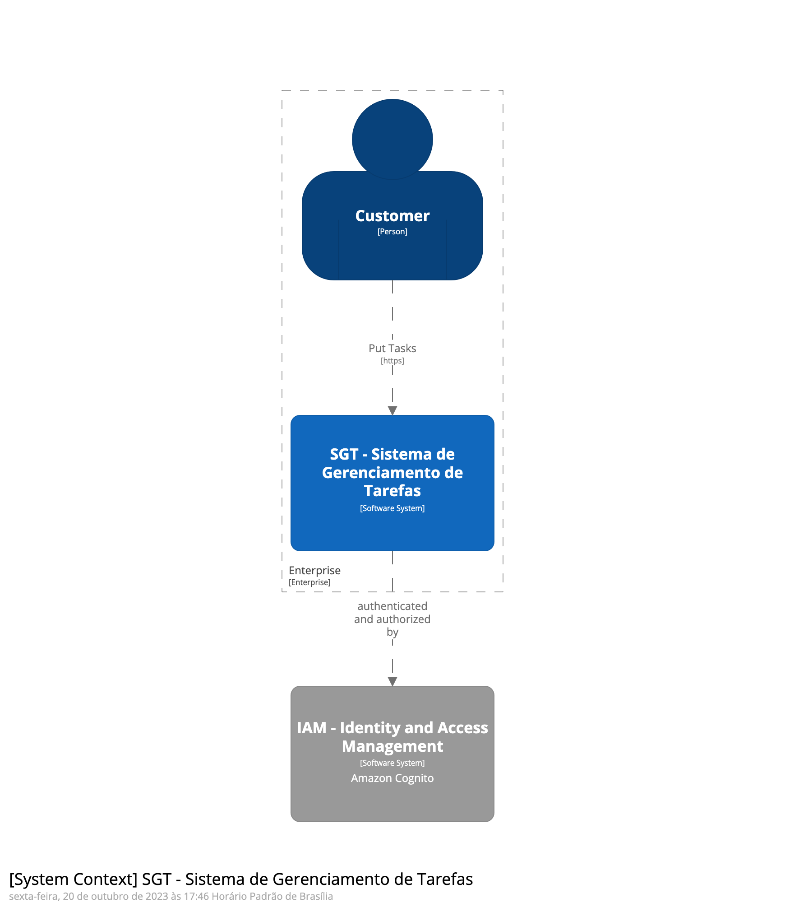
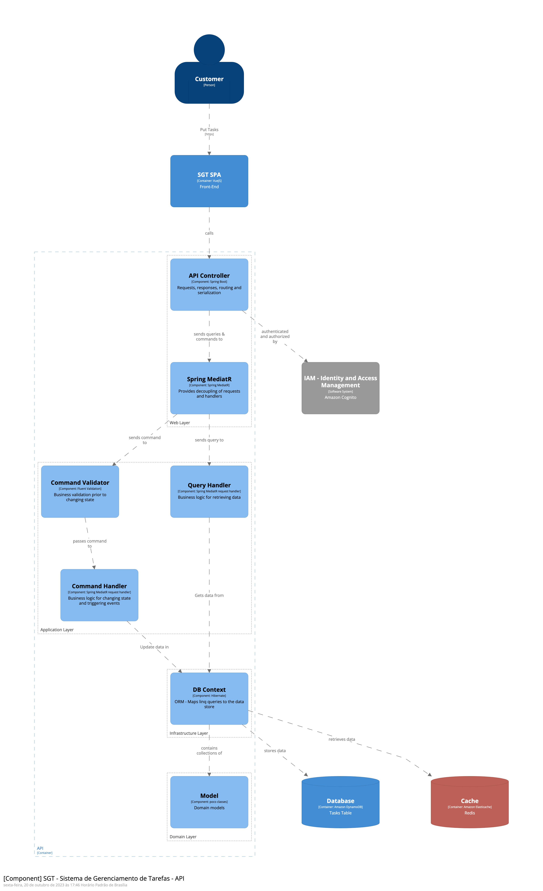

# Sistema de Gerenciamento de Tarefas

Este documento descreve a arquitetura de alto nível do Sistema de Gerenciamento de Tarefas, realçando seus principais componentes, tecnologias usadas e medidas de segurança. 
O sistema é projetado para permitir que os usuários criem, visualizem, atualizem e excluam tarefas eficientemente, sendo altamente escalável e seguro.

## Arquitetura do Sistema

### Principais Componentes

1. <b>Frontend Web Application</b>:

    * Tecnologia: VueJS
    * Justificativa: Diferentemente dos outros frameworks, o VueJS foi feito para ser utilizado como uma biblioteca, não um SPA monolítico. Isso é bom para integrar um algo a mais em páginas já existente. Ele também pode ser utilizado de forma monolítica sendo compilado através de WebPack e tal, Mas não é seu uso primário, vamos focar no uso primário aqui.

2. <b>Backend Application</b>:
    
   * Tecnologia: RESTFul API com Java + Spring Boot
   * Justificativa: Java é uma linguagem de programação popular e amplamente utilizada em empresas. Spring Boot é um framework que permite o desenvolvimento rápido de aplicativos em Java, com recursos como injeção de dependência e configuração automática. Juntos, eles fornecem uma base sólida para o desenvolvimento do back-end.

3. <b>Banco de Dados</b>:

   * Tecnologia: Amazon DynamoDB
   * Justificativa: O Amazon DynamoDB é um banco de dados NoSQL sem servidor, totalmente gerenciado e escalável, que aceita modelos de dados de chave/valor e documentos. Ele foi criado para executar aplicações de alta performance e na escala da Internet que sobrecarregariam bancos de dados relacionais tradicionais. Teríamos como principais benefícios:
   
     *  <b>Performance consistente</b>: O DynamoDB oferece performance consistente de até 9 ms, garantindo que as requisições sejam atendidas rapidamente.
     *  <b>Disponibilidade alta</b>: O DynamoDB oferece disponibilidade de até 99,999%, garantindo que o sistema esteja sempre disponível para os usuários.
     *  <b>Segurança e backup</b>: O DynamoDB ajuda a proteger os dados com criptografia e faz backup contínuo dos dados para proteção.
     *  <b>Modelo de preço flexível</b>: O DynamoDB oferece um modelo de preço flexível, permitindo que o sistema cresça conforme necessário sem custos excessivos.

4. <b>Estratégia de Cache</b>:
   
   * Tecnologia: Amazon ElastiCache (Redis)
   * Justificativa: O Elasticache é um serviço gerenciado da AWS que fornece cache em memória escalável e de alta performance. Ele é compatível com os mecanismos de cache Memcached e Redis, e pode ser facilmente integrado com outras soluções da AWS, como o Amazon EC2 e o Amazon RDS. O Elasticache ajuda a melhorar a performance e a escalabilidade de aplicações web, jogos e sistemas de gerenciamento de sessões.
      Podemos obter os seguintes benefícios:
        * Performance: O Elasticache fornece cache em memória escalável e de alta performance, ajudando a melhorar a performance da API Rest.
        * Escalabilidade: O Elasticache é escalável e pode ser facilmente integrado com outras soluções da AWS, permitindo que a API Rest cresça conforme necessário.
        * Gerenciamento de cache: O Elasticache fornece uma API para gerenciar o cache, permitindo que a API Rest gerencie o cache de forma eficiente.

5. <b>Serviço de Autenticação</b>:

   * Tecnologia: AWS Cognito
   * Justificativa: O Amazon Cognito é um serviço gerenciado da AWS que fornece autenticação, autorização e gerenciamento de usuários para aplicativos web e móveis. Ele suporta os padrões de autenticação e autorização OAuth 2.0 e OpenID Connect (OIDC), que são amplamente utilizados na indústria. Principais benefícios do uso do Cognito:
     * Segurança: O OAuth 2.0 e o OIDC são padrões de segurança amplamente utilizados na indústria, que fornecem autenticação e autorização seguras para os usuários.
     * Facilidade de uso: O Amazon Cognito fornece uma API fácil de usar para autenticação e autorização, permitindo que os desenvolvedores se concentrem no desenvolvimento de aplicativos em vez de gerenciar a autenticação e autorização.
     * Gerenciamento de usuários: O Amazon Cognito fornece um serviço gerenciado para o gerenciamento de usuários, permitindo que os desenvolvedores gerenciem usuários de forma eficiente.
     * Integração com outros serviços da AWS: O Amazon Cognito pode ser facilmente integrado com outros serviços da AWS, como o Amazon API Gateway e o AWS Lambda, permitindo que os desenvolvedores criem aplicativos escaláveis e seguros.

6. <b>Balanceador de Carga</b>:

   * Tecnologia: Amazon Elastic Load Balancer
   * Justificativa: O Amazon Elastic Load Balancer é um serviço gerenciado de balanceamento de carga que distribui as requisições entre os servidores, garantindo alta disponibilidade e escalabilidade. Principais benefícios:
     * Escalabilidade automática: O ELB distribui automaticamente o tráfego entre vários destinos, permitindo que o sistema cresça conforme necessário para acomodar um grande número de usuários e tarefas.
     * Alta disponibilidade: O ELB distribui o tráfego entre várias zonas de disponibilidade, garantindo que o sistema esteja sempre disponível para os usuários.
     * Gerenciamento de tráfego: O ELB fornece um serviço gerenciado para o gerenciamento de tráfego, permitindo que os desenvolvedores gerenciem o tráfego de forma eficiente.
     * Segurança: O ELB fornece recursos de segurança, como SSL/TLS, proteção contra ataques DDoS e autenticação de clientes.
     * Facilidade de uso: O ELB é fácil de usar e pode ser facilmente integrado com outros serviços da AWS, como o Amazon EC2 e o Amazon RDS.

7. <b>Servidores</b>:

   * Tecnologia: Amazon ECS
   * Justificativa: O Amazon Elastic Container Service é um serviço gerenciado de orquestração de contêineres que permite executar e escalar aplicativos em contêineres Docker. Principais benfeícios:
     * Escalabilidade automática: O ECS fornece escalabilidade automática para os aplicativos em contêineres, permitindo que o sistema cresça conforme necessário para acomodar um grande número de usuários e tarefas.
     * Alta disponibilidade: O ECS distribui os contêineres entre várias zonas de disponibilidade, garantindo que o sistema esteja sempre disponível para os usuários.
     * Gerenciamento de tráfego: O ECS fornece um serviço gerenciado para o gerenciamento de tráfego, permitindo que os desenvolvedores gerenciem o tráfego de forma eficiente.
     * Segurança: O ECS fornece recursos de segurança, como integração com o AWS Identity and Access Management (IAM) e proteção contra ataques DDoS.
     * Facilidade de uso: O ECS é fácil de usar e pode ser facilmente integrado com outros serviços da AWS, como o Amazon EC2 e o Amazon RDS.

### Medidas de Segurança
Para proteger os dados do usuário, podemos incorporar as seguintes medidas de segurança:

* Autenticação e Autorização: Utilizamos AWS Cognito ou OAuth 2.0 para autenticar usuários e controlar o acesso a recursos.
* Criptografia: Implementamos criptografia SSL/TLS para proteger a comunicação entre o cliente e o servidor.
* Firewalls e Grupos de Segurança: Configuramos grupos de segurança para restringir o tráfego de entrada e saída nas instâncias EC2.
* Backup e Recuperação: Realizamos backups regulares do banco de dados e mantemos procedimentos de recuperação de desastres.
* Auditoria de Segurança: Monitoramos e auditamos logs para identificar atividades suspeitas.

### Alta Disponibilidade
Para garantir alta disponibilidade e evitar pontos únicos de falha, podemos adotar as seguintes práticas:
* Balanceamento de carga: Usar o Amazon Elastic Load Balancer para distribuir as requisições entre os servidores.
* Escalabilidade horizontal: Adicionar mais servidores conforme necessário para lidar com o aumento do tráfego.
* Replicação de Banco de Dados e Escalabilidade: O Amazon DynamoDB é um banco de dados NoSQL totalmente gerenciado e sem servidor que oferece escalabilidade ilimitada e replicação ativa/ativa de dados para resiliência. Ao utilizar o DynamoDB como solução de banco de dados na arquitetura proposta, podemos obter os seguintes benefícios em disponibilidade e resiliência:
  * Replicação síncrona: O DynamoDB replica dados de forma síncrona entre três instalações em uma região da AWS, proporcionando alta disponibilidade e resiliência de dados.
  * Modelo de consistência: O DynamoDB oferece um modelo de consistência que permite aos usuários especificar se desejam que a leitura seja eventualmente consistente ou fortemente consistente, garantindo que os dados estejam sempre disponíveis e atualizados.
  * Escalabilidade ilimitada: O DynamoDB oferece escalabilidade ilimitada, permitindo que o sistema cresça conforme necessário para acomodar um grande número de usuários e tarefas.
  * Performance consistente: O DynamoDB oferece performance consistente de até 9 ms, garantindo que as requisições sejam atendidas rapidamente.
  * Resiliência de objetos: A resiliência de objetos do DynamoDB pode chegar até 99%, garantindo que os dados estejam sempre disponíveis e atualizados.

### Tecnologias, Bibliotecas e Ferramentas
* Java: Linguagem de programação para o back-end.
* Spring Boot: Framework para desenvolvimento rápido de aplicativos em Java.
* Amazon Web Services (AWS): Plataforma de computação em nuvem para hospedar o sistema.
* Amazon DynamoDB: Serviço de banco de dados relacional gerenciado pela AWS.
* Amazon EC2: Serviço de computação em nuvem para executar os servidores.
* Amazon Elastic Load Balancer: Serviço de balanceamento de carga gerenciado pela AWS.
* Amazon Elastic Container Service: Serviço de orquestração de contêineres gerenciado pela AWS.
* Docker: Plataforma de contêineres para empacotar e distribuir aplicativos.
* Hibernate: Framework de mapeamento objeto-relacional para Java.
* Spring Security: Framework de segurança para aplicativos Spring.
* VueJS: Framework para desenvolvimento de interfaces de usuário.

### Diagrama de Contexto

### Diagrama de Container

### Diagrama de Componente
